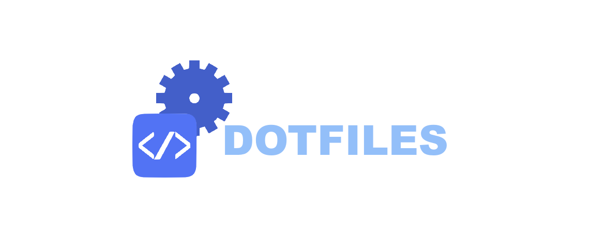
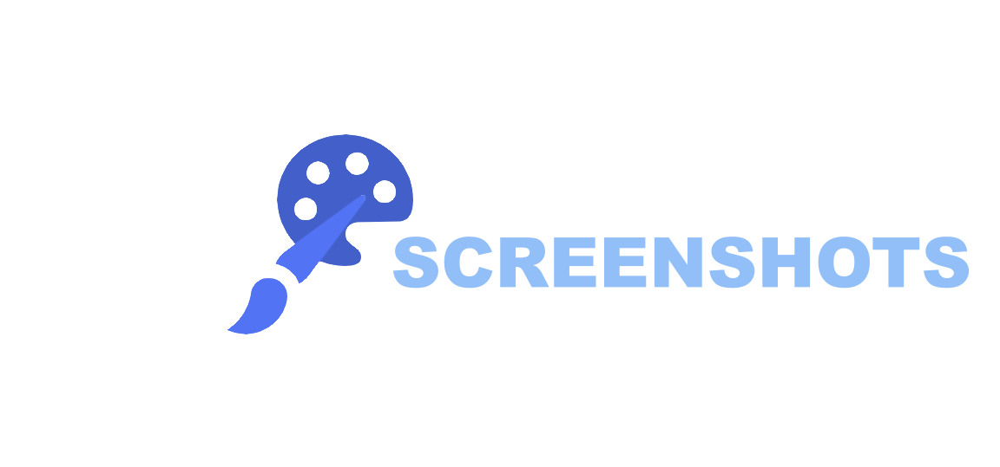
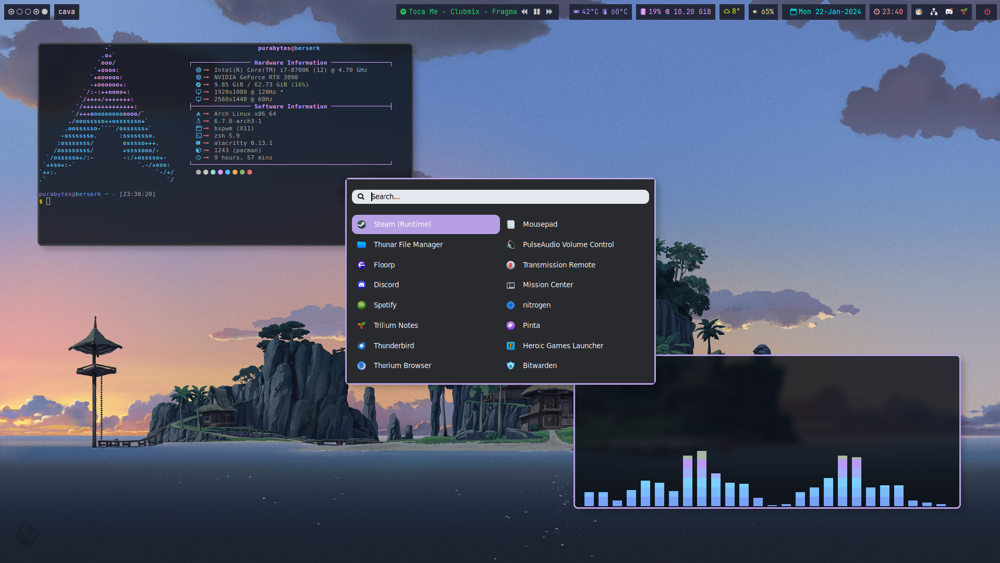
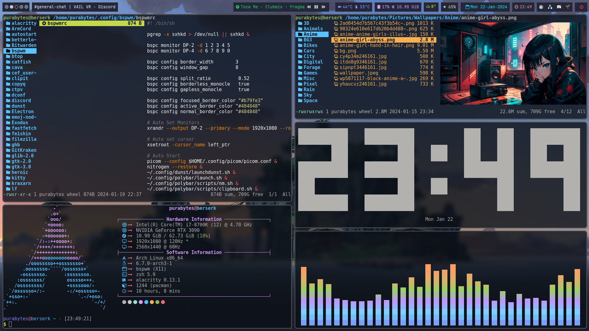
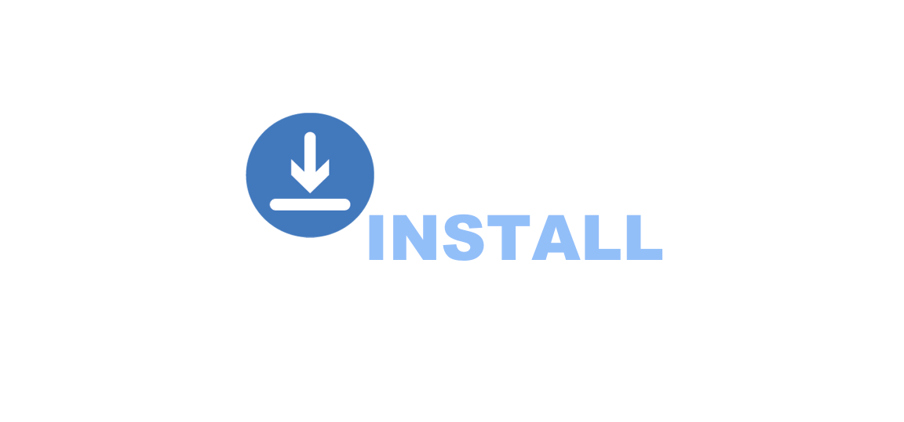

<a href="#"></a>

### Hello there! Welcome to my dotfiles page :octocat:

This repo hosts dotfiles that I use and utilizes bspwm, sxhkd, rofi, and more.

Some details about the setup:

<a href="#"></a>

- **WM**                           : [bspwm](https://github.com/baskerville/bspwm) :art:
- **Shell**                        : [zsh](https://wiki.archlinux.org/index.php/zsh) :shell:
- **Terminal**                     : [alacritty](https://github.com/alacritty/alacritty) :cat:
- **Panel**                        : [polybar](https://github.com/polybar/polybar) :shaved_ice:
- **Compositor**                   : [picom](https://aur.archlinux.org/packages/picom-ftlabs-git) :sparkles:
- **Notify Daemon**                : [dunst](https://wiki.archlinux.org/index.php/Dunst) 🔔
- **Application Launcher**         : [rofi](https://github.com/davatorium/rofi) :rocket:
- **File Manager**                 : [thunar](https://wiki.archlinux.org/index.php/Thunar)/[ranger](https://github.com/ranger/ranger)/[lf](https://wiki.archlinux.org/title/Lf) 📂
- **Wallpaper Manager**            : [nitrogen](https://github.com/l3ib/nitrogeni) 🖼️
- **Clipboard Manager**            : [Clipit](https://aur.archlinux.org/packages/clipit) 📎

<br/>
<br/>
<br/>
<br/>
<br/>
<br/>

<a href="#"></a>

<details>
<summary>Screenshots of the rice</summary>

# screenshots here





</details>

<a href="#"></a>

# Easy Install

Easiest way to install is to use the script provided. If you are looking to manually install, please read below.

##### clone repo

```unix
git clone https://github.com/purabytes/dotfiles.git
```

##### giving script perms

```unix
chmod +x install.sh
```

##### running the install

```unix
./install.sh
```

### Or, use the single line installer


```unix
git clone https://github.com/purabytes/dotfiles.git && cd dotfiles && chmod +x install.sh && ./install.sh
```

> **Please note!** this will install software that I personally use! Go over the script to add/remove what you want or need!

# Manual Install

### software

First, we will need to make sure that we have yay installed:

```
```unix
sudo pacman -S --needed git base-devel && git clone https://aur.archlinux.org/yay-bin.git && cd yay-bin && makepkg -si && cd .. && sudo rm -r yay-bin
```

After yay is done installing, we can move on to install the software that we use. This includes nvidia stuff too:

```unix
linux-headers nvidia-dkms nvidia-utils nvidia-settings lib32-nvidia-utils nvidia-libgl lib32-nvidia-libgl vulkan-icd-loader lib32-vulkan-icd-loader libvdpau mesa vdpauinfo libglvnd libva libva-utils lib32-mesa lib32-libvdpau lib32-libva-vdpau-driver lib32-libglvnd lib32-libva wine-staging giflib lib32-giflib libpng lib32-libpng libldap lib32-libldap gnutls lib32-gnutls mpg123 lib32-mpg123 openal lib32-openal v4l-utils lib32-v4l-utils libpulse lib32-libpulse libgpg-error lib32-libgpg-error alsa-plugins lib32-alsa-plugins alsa-lib lib32-alsa-lib libjpeg-turbo lib32-libjpeg-turbo sqlite lib32-sqlite libxcomposite lib32-libxcomposite libxinerama lib32-libgcrypt libgcrypt lib32-libxinerama ncurses lib32-ncurses ocl-icd lib32-ocl-icd libxslt lib32-libxslt libva lib32-libva gtk3 lib32-gtk3 gst-plugins-base-libs lib32-gst-plugins-base-libs vulkan-icd-loader lib32-vulkan-icd-loader alacritty alsa-plugins alsa-utils android-tools arandr arc-gtk-theme ark base base-devel bash-completion bat bind bitwarden blender bspwm btop calc catfish cifs-utils discord dmenu dog duf dunst dust element-desktop fastfetch filezilla firefox git glow graphicsmagick gst-plugins-base-libs gvfs gvfs-afc handbrake intel-ucode intltool jq kitty krita lf lib32-alsa-plugins lib32-giflib lib32-gnutls lib32-gst-plugins-base-libs lib32-gtk3 lib32-libglvnd lib32-libjpeg-turbo lib32-libpng lib32-libpulse lib32-libva lib32-libva-vdpau-driver lib32-libvdpau lib32-libxcomposite lib32-libxinerama lib32-libxslt lib32-mpg123 lib32-nvidia-utils lib32-ocl-icd lib32-openal lib32-opencl-nvidia lib32-pipewire lib32-pipewire-jack lib32-sqlite lib32-v4l-utils libglvnd libreoffice-fresh libva-utils libxslt lsd lutris lxappearance man-db mangohud monero-gui mousepad nano nano-syntax-highlighting neovim network-manager-applet networkmanager networkmanager-openvpn nitrogen noto-fonts-cjk noto-fonts-emoji npm ntfs-3g obs-studio openal openbsd-netcat p7zip pamixer pavucontrol pinta pipewire-alsa pipewire-pulse playerctl plocate polybar psensor qalculate-gtk qjackctl qt5ct rofi scrcpy scrot sddm signal-desktop steam sxhkd telegram-desktop thunar thunar-volman thunderbird tldr transmission-remote-gtk ttf-dejavu ttf-fira-code ttf-font-awesome ttf-inconsolata ttf-liberation ttf-linux-libertine ttf-opensans ttf-ubuntu-font-family tumbler ufw unzip vdpauinfo veracrypt vi vim vlc wget wine-staging xclip xcolor xdg-desktop-portal xdg-desktop-portal-gtk xdg-user-dirs xorg-bdftopcf xorg-iceauth xorg-mkfontscale xorg-server xorg-sessreg xorg-setxkbmap xorg-smproxy xorg-twm xorg-x11perf xorg-xauth xorg-xbacklight xorg-xclock xorg-xcmsdb xorg-xcursorgen xorg-xdpyinfo xorg-xdriinfo xorg-xev xorg-xgamma xorg-xhost xorg-xinit xorg-xinput xorg-xkbcomp xorg-xkbevd xorg-xkbprint xorg-xkbutils xorg-xkill xorg-xlsatoms xorg-xlsclients xorg-xmodmap xorg-xpr xorg-xrandr xorg-xrdb xorg-xrefresh xorg-xset xorg-xsetroot xorg-xvinfo xorg-xwd xorg-xwininfo xorg-xwud xterm zathura-djvu zathura-pdf-mupdf zathura-ps zip zsh zsh-autosuggestions zsh-completions zsh-history-substring-search zsh-syntax-highlighting alarm-clock-applet ani-cli arc-x-icons-theme betterlockscreen bibata-cursor-theme cava-git clipit ctpv emoj exodus feishin-bin floorp-bin gitkraken gnome-icon-theme heroic-games-launcher-bin kora-icon-theme-git manga-cli-git minecraft-launcher mission-center-git parsec-bin picom-ftlabs-git spotify thorium-browser-bin trilium-bin ttf-icomoon-feather ttf-material-design-iconic-font ttf-material-design-icons-extended ttf-ms-fonts ueberzugpp zscroll-git
```

### nvidia settings

Lets add the following to `/etc/environment`:

```unix
QT_QPA_PLATFORMTHEME=qt5ct
VDPAU_DRIVER="nvidia"
LIBVA_DRIVER_NAME="vdpau"
```

Then test it with the following, you should see some output:

```unix
awk '/H264|HEVC/' <<<$(vdpauinfo)
awk '/nvidia|vdpau/' <<<$(pacman -Qe)
awk '{for (I=1;I<=NF;I++) if ($I ~ "nvenc") print $I}' <<<$(ffmpeg -codecs 2>&1)
```

### Fonts

Time to install some fonts. Lets first install Fira Code and Meslo fonts:

```unix
mkdir tempfonts && cd tempfonts && \
wget https://github.com/ryanoasis/nerd-fonts/releases/download/v1.1.0/FiraCode.zip && \
wget https://github.com/ryanoasis/nerd-fonts/releases/download/v1.1.0/Meslo.zip
```

unzip and delete the *`.zip` files:

```unix
unzip FiraCode.zip && unzip Meslo.zip && sudo rm FiraCode.zip && sudo rm Meslo.zip
```

Copy the unzipped fonts to `/usr/share/fonts/`:

```unix
sudo cp * /usr/share/fonts/
fc-cache -vf
```

now you can `cd ..` and `rm -r tempfonts`.

Now for the nerd fonts:

You can either get the [repo here](https://github.com/purabytes/fonts), or execute the command below:

```unix
git clone https://github.com/purabytes/fonts.git && cd fonts
mkdir -P .local/share/fonts
cp -R Fonts/* .local/share/fonts
```

We can also clone the whole nerds font and install it:

```unix
git clone https://github.com/ryanoasis/nerd-fonts.git
```

Go into the dir and `./install.sh`:

```unix
cd nerd-fonts && ./install.sh
```

# Misc

Settings ZSH as default (can run sudo to make zsh for root also):


```unix
zsh && chsh -s /bin/zsh
```

### Configs

Lets copy over config files:

```unix
cp -R Root/* $HOME/
cp -R Config/* $HOME/.config
```

# Locale

make sure `nl_NL` is uncommented in `/etc/locale.gen`.
Then, add the following to the bottom of `/etc/profile`:

```unix
# English language with Dutch locale
export LANG=en_US.UTF-8
#export LANGUAGE="en_US:en"
export LC_MESSAGES="en_US.UTF-8"
export LC_CTYPE="nl_NL@euro"
export LC_COLLATE="nl_NL@euro"
export LC_TIME="nl_NL"
export LC_NUMERIC="nl_NL"
export LC_MONETARY="nl_NL@euro"
export LC_PAPER="nl_NL"
export LC_TELEPHONE="nl_NL"
export LC_ADDRESS="nl_NL"
export LC_MEASUREMENT="nl_NL"
export LC_NAME="nl_NL"
```

# Firewall

You may not enter! Lets install `ufw`:

```unix
sudo pacman -S ufw && sudo systemctl enable ufw.service && sudo systemctl start ufw.service && sudo ufw enable
```

We can now configure ufw to block some ports or allow some ports.

# Custom Steam Proton

We all love video games. Lets install the custom proton-ge from gloriouseggroll:

https://github.com/GloriousEggroll/proton-ge-custom/releases/

After you have the file, navigate to `~/Downloads`, unzip/untar and copy the files over to `/home/syber/.steam/root/compatibilitytools.d/`.

# Last changes

Change the city from `Amsterdam` to your city, and the `api-key` to your weather api key in:

```unix
nano .config/polybar/scripts/weather/weather.sh
```

Change the fastfetch `username@host` in:

```unix
nano .config/fastfetch/config.json
```

Change your monitor layout for polybar in:

```unix
nano .config/polybar/bars.ini
```

> To find out what DP-0, or HDMI-0 etc you have, run `xrandr` in terminal.

Change the printscreen location (username), and make sure that the location exists (Pictures/Screenshots/{Normal,Frozen,Online} in:

```unix
nano .config/sxhkd/sxhkdrc
```

# Wallpapers

You can clone the wallpaper [repo here.](https://github.com/purabytes/wallpapers)